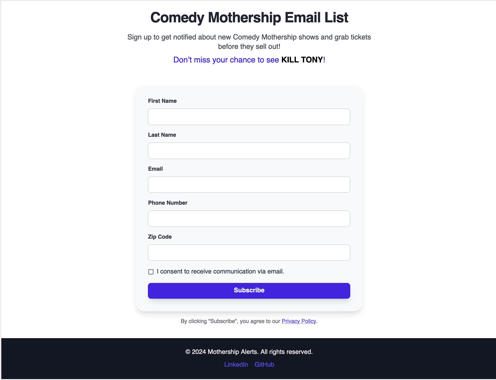
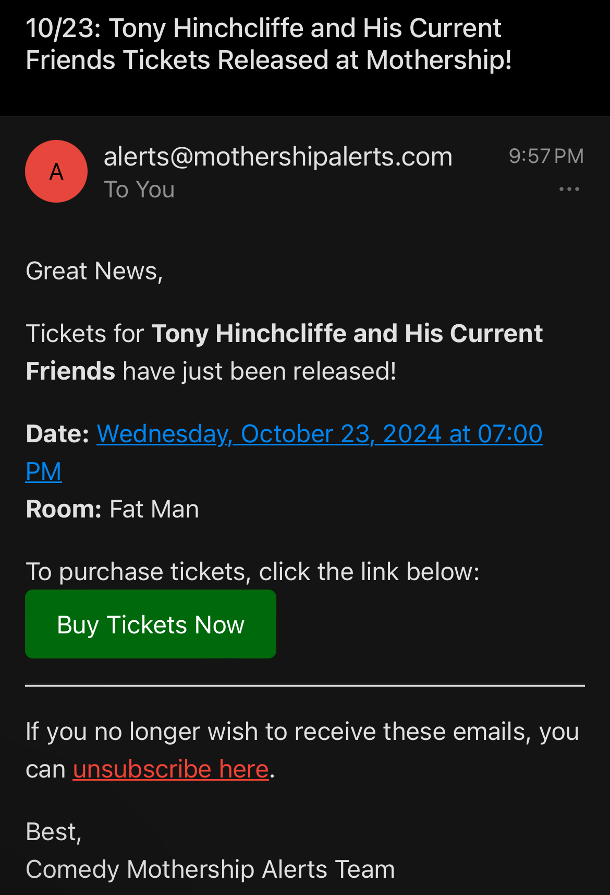

# Mothership Alerts

**Mothership Alerts** is a web app designed to help comedy fans in Austin, TX get notified when new shows are added at the Comedy Mothership. Tired of missing out on shows from big names like Kill Tony, Joe Rogan, or Shane Gillis? Mothership Alerts can help! By signing up for the email list, you'll have a better chance of securing tickets before they sell out.

[Visit the website](https://mothershipalerts.com)


---

## Features:

- 🎟️ **Real-time email notifications** when new shows are scheduled at the Comedy Mothership.
- ✉️ **Easy unsubscribe** functionality to opt out of alerts at any time.
- 💻 **User-friendly interface** built with Tailwind CSS, React, and Vite.
- 🌐 **Secure and responsive** design that works across devices.

---

## Technologies Used:

- **Frontend**: Vite, React, Tailwind CSS
- **Backend**: Flask (Python)
- **Database**: MongoDB
- **Hosting**: DigitalOcean with NGINX

---

## App Preview:




---

## How to Use:

1. **Sign up** on the website [here](https://mothershipalerts.com).
2. **Receive email notifications** for newly announced Comedy Mothership shows.
3. **Unsubscribe** at any time via the email link or through the unsubscribe page on the website [here](https://mothershipalerts.com/unsubscribe).

---

## How to Run Locally:

If you want to run the project locally, follow these steps:

1. Clone the repository:

   ```bash
   git clone https://github.com/JackGreezy/mothershipalerts.git

   ```

2. Navigate to the project folder:

   ```bash
      cd mothershipalerts

   ```

3. Install frontend dependencies:

   ```bash
    cd frontend/mothershipAlerts-frontend
    npm install
    npm run build

   ```

4. Run the Flask backend:
   ```bash
    cd ../backend
    flask run --host=0.0.0.0
   ```

How to Deploy on DigitalOcean:

You can deploy this app on DigitalOcean as follows:

1. Set up a Droplet:
   Create a new Droplet on DigitalOcean with Ubuntu as the operating system.

2. Install necessary dependencies:

   ```bash
   sudo apt-get update
   sudo apt-get install python3-pip nginx nodejs

   ```

3. Clone the repository to the server:

   ```bash
   git clone https://github.com/JackGreezy/mothershipalerts.git

   ```

4. Set up your backend environment:

   - Install Python dependencies:

   ```bash
   cd backend
   pip install -r requirements.txt
   ```

   - Set up MongoDB and ensure the credentials are correctly stored in your .env file:

   ```bash
   MONGO_USERNAME=<your_mongo_username>
   MONGO_PASSWORD=<your_mongo_password>
   MONGO_CLUSTER_URL=<your_cluster_url>
   MONGO_DB_NAME=<your_db_name>
   ```

Configure NGINX:

    Set up Nginx to serve your frontend (from the dist folder after building) and proxy API requests to Flask.

Secure the site:

    Install and configure an SSL certificate using Let’s Encrypt for HTTPS support:

    ```bash
    sudo apt-get install certbot python3-certbot-nginx
    sudo certbot --nginx -d yourdomain.com
    ```

7. Run your app using Flask in production mode or with a WSGI server like Gunicorn.
   - Example using Gunicorn:
   ```bash
   gunicorn --bind 0.0.0.0:5000 wsgi:app
   ```

Future Improvements:
Add a feature to track ticket prices.
Create a premium service for text alerts and automated checkout

Challenges:
One of the major challenges in building this app was setting up the SSL certificate and domain pointing for the first time. Debugging the Flask API routes and ensuring the frontend and backend could communicate seamlessly via NGINX was also a learning experience.

License:
This project is licensed under the MIT License - see the LICENSE.md file for details.

Contact:

If you have any questions or would like to collaborate, feel free to reach out to me via LinkedIn.

Click here to [visit the website](https://mothershipalerts.com)
